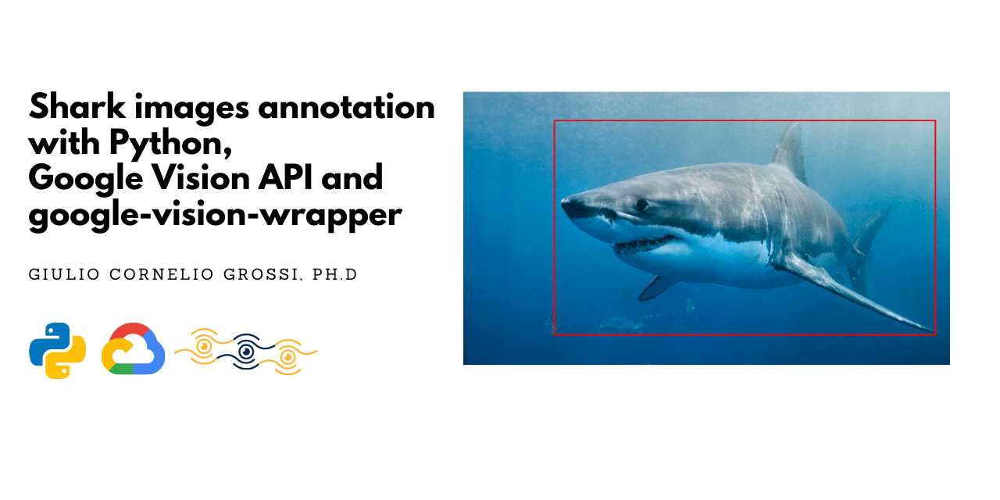

# Shark images annotation using Python 🐍, Google Vision API and google-vision-wrapper 👁
### Problem statement 
I am currently setting up a bounding box regression model to construct a shark detector, which will be able to correctly spot and classify different shark species in an image. I have about 2'000 shark images organized in this folder structure:
 
 ```
 ./
  ├─── sharks
       ├───great_white_shark
       ├───hammerhead_shark
       ├───mako
       ├───not_shark
       ├───tiger_shark
       └───whale_shark
 ```
  
 each subfolder of ```sharks``` contains images of the shark specie specified in the folder name (thus the folder name is acting as a label for each class). I need to write down (annotate) some information for each image:
 
 1. file name
 2. label
 3. (x,y) coordinate of bounding box's top-left corner
 4. (x,y) coordinate of bounding box's bottom right corner
 
 and dump it in a csv file. Usually this is done by hand, using some annotating tool (online or offline), but today we are going to exploit the Google Vision API, along with a python package ```google-vision-wrapper```

### Setup Google Vision API and google-vision-wrapper
Google Vision API is a service provided by Google, which enables to send a request to their API and perform different kind of computer vision tasks: face detection, label detection, object detection as well as optical character recognition (OCR). Today we are going to use the object detection feature.  
 
```google-vision-wrapper``` is an handy python package that simplifies the interface and the request to the API in an effective way. The working environment requires to have a Google Cloud Platform Account, the Google Vision API enabled and the ```google-vision-wrapper``` package installed via:
 
 ```pip install google-vision-wrapper```
 
The installation procedure can be found on the [project's Github page](https://github.com/gcgrossi/google-vision-wrapper), together with the links to properly setup the Google Vision API. 

Once everything is setup, we can move on to the juicy part: Python.
 
### Python Script
in the root directory I create a file named  ```annotate_images.py``` and start by importing.
 
#### Imports
  ```python
 
import os
import cv2

import numpy as np
import pandas as pd
 
 from csv import writer
 from gvision import GVisionAPI
 
 ```
 
the python package of ```google-vision-wrapper``` is ```gvision``` and from it we import the ```GVisionAPI``` class. We will need the other packages in the future. From here we proceed by writing some helper functions.
 
#### Helper Functions
 ```python
 
file_extensions = (".jpg", ".jpeg", ".png", ".bmp", ".tif", ".tiff")

def list_files(indir=os.getcwd(),valid_extensions=file_extensions):
    for (rootdir,dirs,files) in os.walk(indir):
        for filename in files:
            # determine the file extension of the current file
            ext = filename[filename.rfind("."):].lower()
            
            # check to see if the file is an image and should be processed
            if valid_extensions is None or ext.endswith(valid_extensions):
                
                # construct the path to the image and yield it
                imagePath = os.path.join(rootdir, filename)
                
                # yield the path
                yield imagePath
            
    return
 ```
 
This function crawls the input directory and checks if the extension of the image is valid. Using the python method ```yield``` it returns an iterator, over which we will loop later on in the annotation face.

```python 

def load_annotation(annotation_file):
    
    # init DataFrame columns
    header_list = ["image","label","tlx","tly","brx","bry"]

    # check if the annotation file exists
    if os.path.isfile(annotation_file) : 
        # if yes -> read as DataFrame
        df = pd.read_csv(annotation_file,names=header_list)
    else:
        # if no -> create an empty DataFrame
        df = pd.DataFrame(columns = header_list)
    
    return df
 
 ``` 
 
This function opens an input csv file and returns a pandas DataFrame with the stored info.

```python
 
def add_annotation(annotation_csv,annotation_list):

    with open(annotation_csv, 'a+', newline='') as write_obj:
        # Create a writer object from csv module
        csv_writer = writer(write_obj)
        # Add contents of list as last row in the csv file
        csv_writer.writerow(annotation_list)
    return
 
 ```
 
This function opens an input csv file and appends an input list (which should be correctly comma separated) to the existing file.
 
#### Main Function
It's now time write the main function and let the magic begin:

```python

def main():
    
    # init path to files
    cwd=os.getcwd()
    dataset_path=os.path.join(cwd,"shark")
    annotation_csv = os.path.join(dataset_path,"shark_annotation.csv")

    # load annotation as pandas dataframe
    # obtain the images that already annotated
    df_annotation = load_annotation(annotation_csv)
    annotated_images = df_annotation['image'].to_list()

```

we first of all construct the path to the annotation csv file on disk. After we load the file using the helper function we just constructed and we select the image filename column as a list. We will need it to understand if an image was already annotated or not.

```python

    # initialize google vision api
    gvision_auth=os.path.join(cwd,"google_vision","gvision_auth.json")
    gvis = GVisionAPI(gvision_auth)
    
    #obtain image paths
    image_paths = list(list_files(dataset_path))

    max_images = 1000
    image_count = 0   

```

here we finally initialize a Google Vision Api client using [google-vision-wrapper](https://github.com/gcgrossi/google-vision-wrapper). I put the authorisation json file generated from my GCP account in a folder named ```google_vision``` and give it as an input to the ```GVisionAPI``` class.

We then use the helper function ```list_files``` to generate a list of image paths. We also iniatialize a counter to handle a maximum image requests we want to process. This is very important since there is a **free tier cap of 1'000 annotation/month!**.

```python
    
    # loop over image list
    for i in image_paths:

        # get image name and label from path
        name = i.split(os.path.sep)[-1]
        label = i.split(os.path.sep)[-2]
        
        # if already annotated -> skip image
        if name in annotated_images: continue

        #read the image
        image = cv2.imread(i)
        image_count+=1

```

We initiate a loop over the image path list and extract the file name and the label from it (rememeber that the label is the folder name in which the image resides). If the filename is already in the annotation list we skip it (there is probably a more efficient way of doing it, but we do not have so much performance constraints here). On the contrary, if we need to annotate the image, we read it and add a counter entry.

```python
    
        #perform a request to the API
        gvis.perform_request(image,'object detection')
        headers,objs = gvis.objects()

        # check if image contains a shark
        for obj in objs: 
            if obj[0] in ['Animal','Shark']:
                
                # draw the true rectangle
                # and print class
                cv2.rectangle(image,(int(obj[2][0]),int(obj[2][1])),(int(obj[4][0]),int(obj[4][1])),(0,255,0), 2)
                print("{} - Class: {}".format(i,obj[0]))
                cv2.imshow("tue", image)

```

After we have the image, we can finally perform a request via the [google-vision-wrapper](https://github.com/gcgrossi/google-vision-wrapper) ```.perform_request``` method with option ```object detection```. after that we retrieve two lists using the ```.objects``` method: first is a list of header that quilifies the information stored in ```objs``` components, while the second is a list, which components is the information of each object detected (stored in a sub-list).

if you print ```header``` you will notice that the components of ```objs``` are lists, which elements are respectively:

1. object name
2. detection confidence
3. top-left (x,y) coordinates of bounding box
4. top-right (x,y) coordinates of bounding box
5. bottom-right (x,y) coordinates of bounding box
6. bottom-left (x,y) coordinates of bounding box

We therefore loop over the objects detected and check if it is an Animal or a Shark. If so we can draw a rectangle on the image using OpenCV and the top-left, bottom-right coordinates of the bounding box. We show the image with the rectangle on screen. Here is an example of what it looks like: 
 
